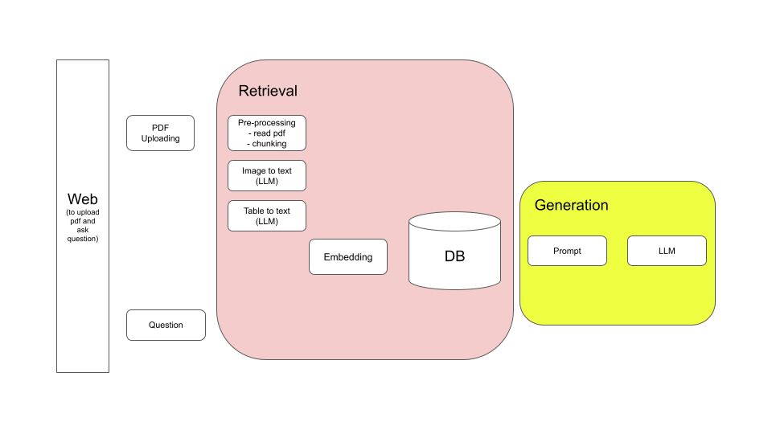

# ctw_interview

This is first system design of PDF chatbot

It gives an interface to upload the pdf files and a window for chatbot in which you ask question about the pdf files that have been uploaded

since it's running locally and my computer does not have enough memory to run embedding model or it takes too long, So, I am randomly generating a vector to replace the correct vector just for testing purpose.

It uses llama-3.3-70b for generation part and llama-3.2-90b for image to text

please make sure you go into each folder to run the run.sh file
for front you need install gradio in your python running env